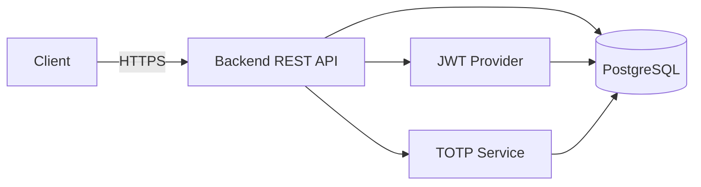

## Cloud 2FA — Backend

Phiên bản backend của dự án Cloud 2FA (Two-Factor Authentication). Đây là dịch vụ REST API xây dựng bằng Spring Boot (Java 17) cung cấp xác thực JWT, quản lý tài khoản TOTP, và các endpoint cho đăng nhập/đăng ký/2FA.

### Giới thiệu

`cloud-2fa` là một backend service nhẹ, hướng REST, đảm nhiệm:

- Quản lý người dùng và xác thực (JWT)
- Quản lý TOTP (Time-based One-Time Password) cho 2FA
- Kết nối cơ sở dữ liệu PostgreSQL bằng Spring Data JPA
- Tài liệu API bằng OpenAPI/Swagger

Thiết kế hướng mở rộng, dễ triển khai bằng Docker và tích hợp CI/CD.

### Tính năng chính

- Xử lý đăng ký/đăng nhập người dùng
- JWT authentication (issue & verify)
- TOTP setup/verify cho 2FA
- Hỗ trợ i18n cho thông báo lỗi và thành công
- Endpoints REST có OpenAPI UI
- Dockerized với Dockerfile đa giai đoạn tối ưu

### Kiến trúc tổng quan



Mô tả: Ứng dụng là một service Spring Boot đơn, tất cả logic business nằm trong `service/`, truy xuất dữ liệu qua `repository/` và bảo mật bằng `security/`.

### Cài đặt

Yêu cầu:
- Java 17
- Maven (hoặc dùng `mvnw` có sẵn)
- Docker (nếu deploy bằng container)

Build local:

```bash
git clone <repo-url>
cd backend
./mvnw clean package -DskipTests
```

Hoặc nếu dùng Maven cục bộ:

```bash
mvn clean package -DskipTests
```

### Chạy dự án

Chạy trực tiếp:

```bash
java -jar target/cloud-2fa-0.0.1-SNAPSHOT.jar
```

Chạy bằng Docker:

```bash
docker build -t cloud-2fa:latest .
docker run --rm -p 8080:8080 \
  -e SPRING_DATASOURCE_URL=jdbc:postgresql://db:5432/cloud2fa \
  -e SPRING_DATASOURCE_USERNAME=postgres \
  -e SPRING_DATASOURCE_PASSWORD=secret \
  -e JWT_SECRET=your_jwt_secret \
  cloud-2fa:latest
```

Hoặc dùng script Windows tích hợp để build và publish image:

```powershell
.\docker-build-and-publish.bat myrepo/cloud-2fa 1.0 myregistry.azurecr.io push
```

### Cấu hình môi trường

Ứng dụng sử dụng `application.properties` trong `src/main/resources` và hỗ trợ override bằng biến môi trường Spring Boot.

Biến môi trường quan trọng:

- `SPRING_DATASOURCE_URL` — JDBC URL tới PostgreSQL
- `SPRING_DATASOURCE_USERNAME` — DB user
- `SPRING_DATASOURCE_PASSWORD` — DB password
- `JWT_SECRET` — bí mật dùng để sign JWT (bắt buộc trên production)
- `SPRING_PROFILES_ACTIVE` — `dev` hoặc `prod`

Ví dụ `application.properties` mẫu:

```properties
spring.datasource.url=${SPRING_DATASOURCE_URL:jdbc:postgresql://localhost:5432/cloud2fa}
spring.datasource.username=${SPRING_DATASOURCE_USERNAME:postgres}
spring.datasource.password=${SPRING_DATASOURCE_PASSWORD:password}
spring.jpa.hibernate.ddl-auto=update
server.port=8080
```

> Tip bảo mật: sử dụng secret manager (Azure KeyVault / AWS Secrets Manager / HashiCorp Vault) cho `JWT_SECRET` và credentials DB.

### Cấu trúc thư mục

Phần backend tuân theo cấu trúc Spring Boot:

```
backend/
├─ Dockerfile
├─ docker-build-and-publish.bat
├─ pom.xml
├─ src/
│  ├─ main/
│  │  ├─ java/org/example/cloud2fa/
│  │  │  ├─ base/
│  │  │  ├─ config/
│  │  │  ├─ constant/
│  │  │  ├─ controller/
│  │  │  ├─ domain/
│  │  │  ├─ exception/
│  │  │  ├─ repository/
│  │  │  ├─ security/
│  │  │  ├─ service/
│  │  │  └─ utils/
│  │  └─ resources/
│  │     ├─ application.properties
│  │     └─ i18n/
```

### Hướng dẫn đóng góp

Muốn đóng góp, làm theo các bước sau:

1. Fork repository
2. Tạo branch feature: `feature/your-topic`
3. Viết unit test và đảm bảo build sạch: `./mvnw -DskipTests package`
4. Tạo Pull Request mô tả rõ thay đổi và cách test

PR checklist:
- [ ] Build thành công
- [ ] Không chứa secrets
- [ ] Có test hoặc tài liệu cho thay đổi lớn

### License

Kiểm tra file `LICENSE` trong repo để biết giấy phép chính xác. Không tái sử dụng code cho mục đích thương mại nếu license cấm.

### Roadmap (gợi ý)

1. Hỗ trợ refresh token và revocation
2. Tích hợp OAuth2 (Google, GitHub)
3. Thêm tracing/metrics (OpenTelemetry, Prometheus)
4. Multi-tenant support
5. Harden security (rate limiting, IP blocking)

### Ví dụ API nhanh

- Đăng ký: `POST /api/v1/auth/register` — payload JSON `{ "username":"...","password":"..." }`
- Đăng nhập: `POST /api/v1/auth/login` — trả về JWT
- TOTP setup: `POST /api/v1/totp/setup` — trả về secret/QR
- TOTP verify: `POST /api/v1/totp/verify` — verify token

Ví dụ curl đăng nhập:

```bash
curl -X POST http://localhost:8080/api/v1/auth/login \
  -H "Content-Type: application/json" \
  -d '{"username":"demo","password":"demo"}'
```

---


